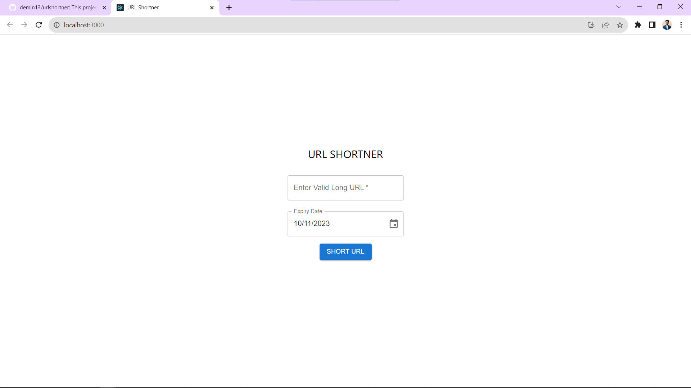
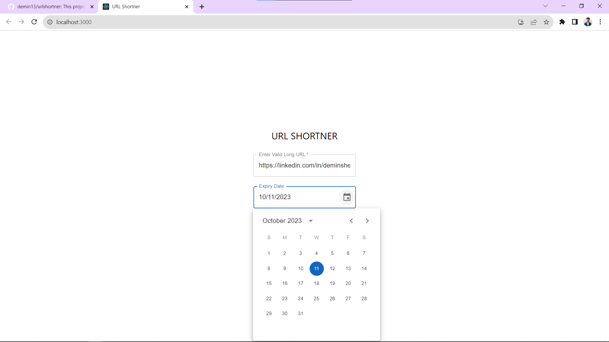
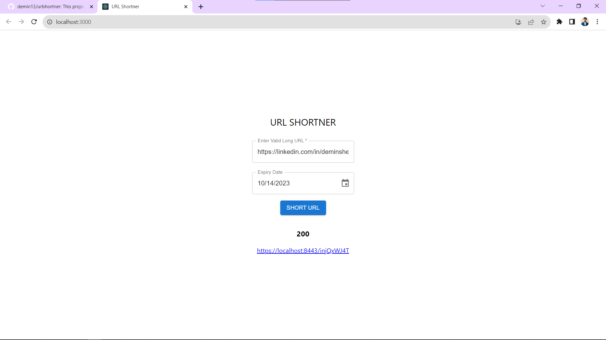
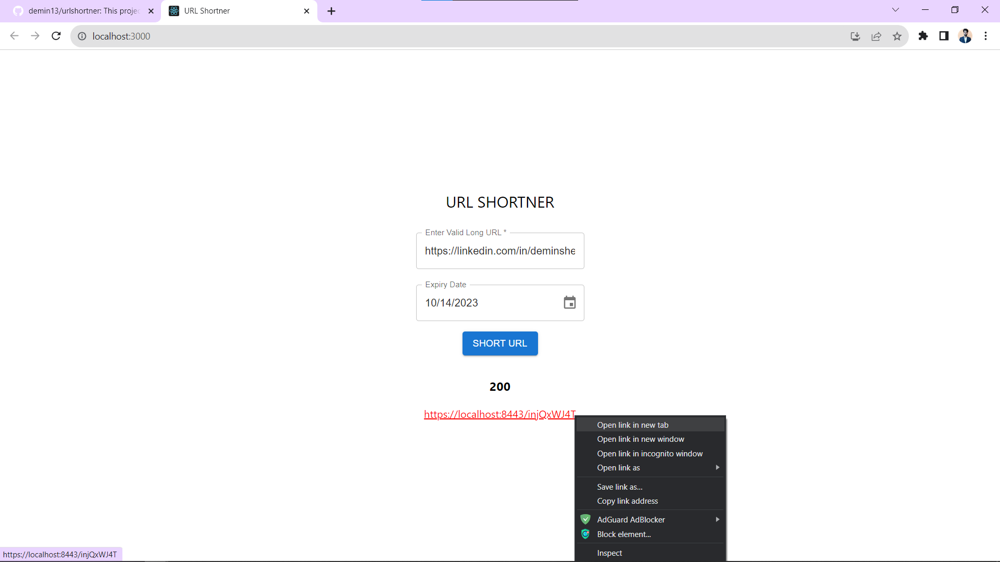
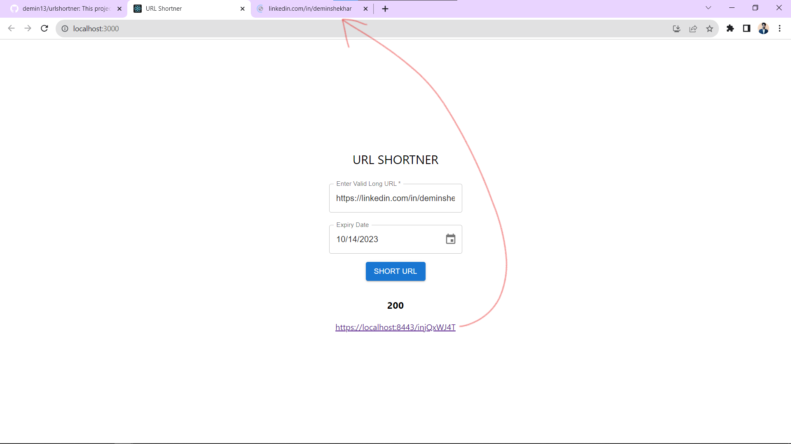

# Getting Started

### Feature Of URL Shortner
* it will ask for a valid long url.
* url shortner will generate a short url.
* Once that generated link will be clicked, it will redirect to the original long url.
* Users can also set the Expiry date.
* The shorten link will only be valid till the expiry date.

### Technology used:-
* Programming Language - Java
* Web Framework (Backend) - Spring Boot
* Web Framework (Frontend) - React
* Database - PostgreSql
* Build Tool - maven

### How to Clone and run locally
    git clone https://github.com/demin13/urlshortner.git

##### Web Framework (Backend)
    mvn clean install
    mvn spring-boot:run

##### Web Framework (Frontend)
    cd urlfrontend
    npm install
    npm start

** Note:- Database needs to be configured either in docker container or local and is accessible on port 5432

### Some Screenshots attached

    

                                 Thanks
    